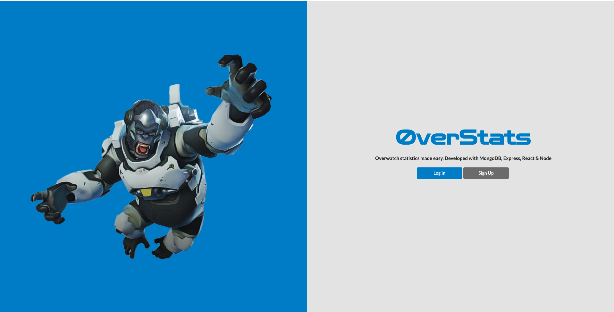
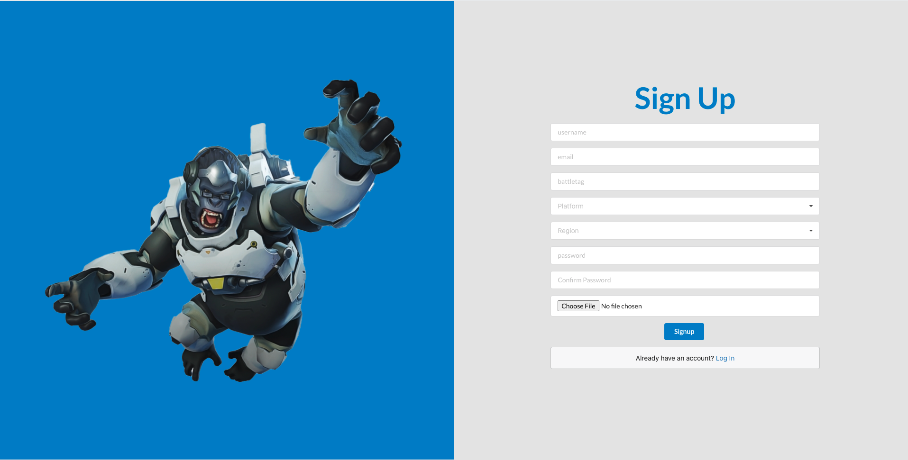
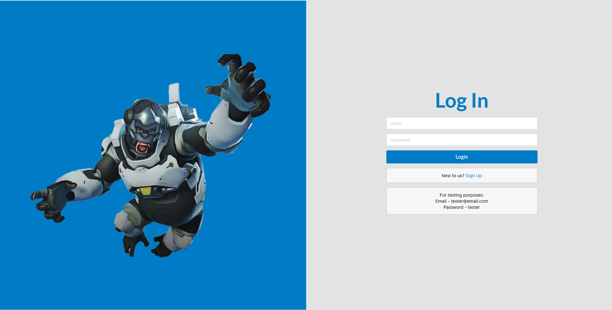
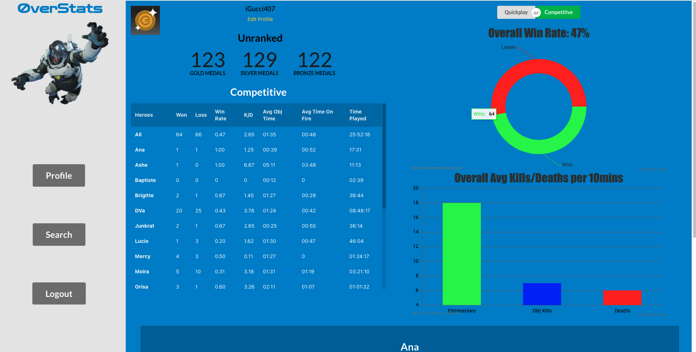
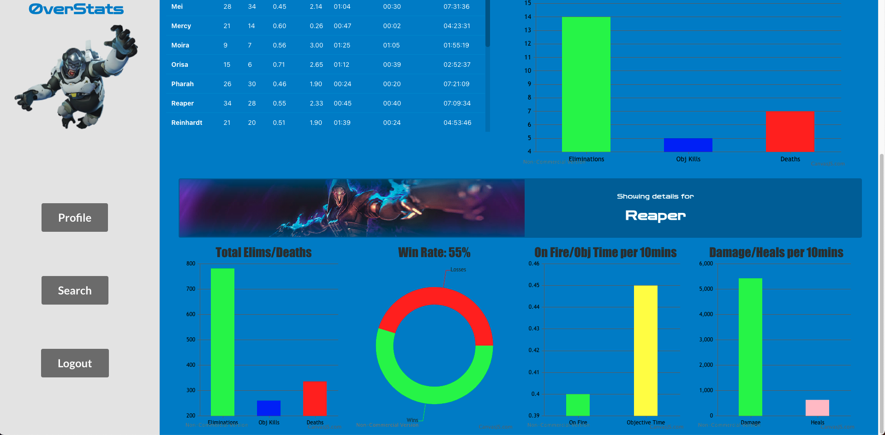
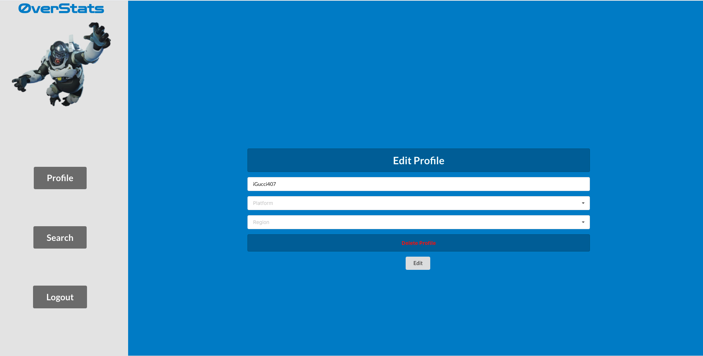
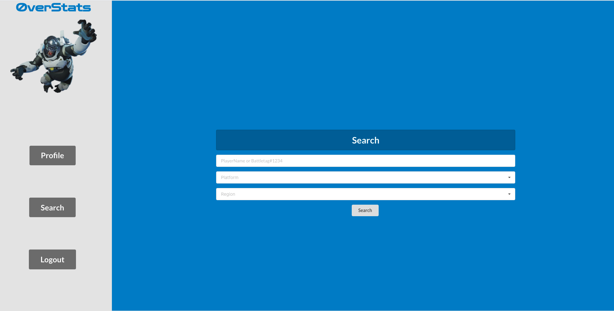
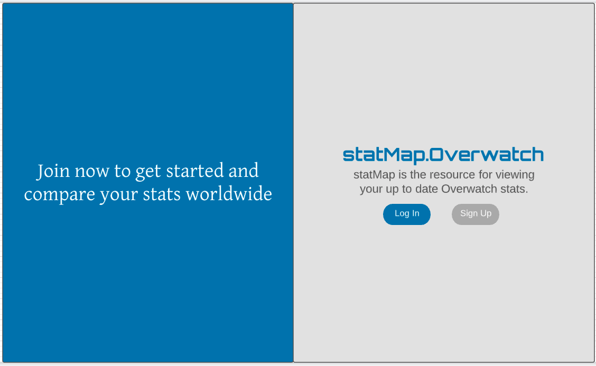

# OverStats

OverStats is a web application that helps users view their in-game Overwatch statistics. Sign up with your battletag(pc) or player name(xbl or psn) and you will be brought to your dashboard that will show your most up to date data clearly visualized in graphs. Want to search other players stats? Click on search and enter the players information to be brought to their profile where you can see how they match up to you.

### Signup & Login

In order to use OverStats, users will need to log in or sign up if they are a new user. Signing up requires a unique username and email not taken by another user, a password, and your Overwatch account details. Once logged in, users will be brought to their profile page where they can view the stats for the Overwatch account given during sign up. If no overwatch details were given or the details were incorrect users will see a message notifying them to update their profile.

### Profile

On your profile page you will see your battletag or player name next to your player avatar, underneath that will be your edit profile link and your rankings/medals. On the right side you will have your overall stats shown to you in a doughnut graph for your win rate and a bar graph for your overall eliminations, obj kills, and deaths. In addition to that you have a table with all of your hero stats. Click on a hero you will be brought down the page to a visualized outlook on that specific heros stats. You can switch between your quickplay stats and competitive with the buttons located on the top right of the page.

### Edit Profile

Your edit profile gives you the option to change the Overwatch account on your profile page. This is great if you have more than one account or if you change your accounts name. Simply enter your new information and your profile will update accordingly.

### Search

The search page gives you access to all Overwatch accounts across platforms. Enter the accounts name, platform, and region to view that players stats.

### Technologies Used

- MongoDB
- Express
- React
- Node.js
- CanvasJS
- Heroku

### Trello Board & Wireframes

- [Trello Board](https://trello.com/b/rp9a5koL/statmap-overwatch)

.png

### Getting Started
To get started simply click the link before and sign up. If you would like a quick way to explore the site there is a tester account, its details are provided on the log in page.

- [Deployed App](N/A)

### Future Features

- Making OverStats a more mobile friendly app is currently my top priority and should be finished soon.
- The ability to have multiple overwatch accounts for a given user.
- I will also be adding images of characters that will appear when their information is shown.